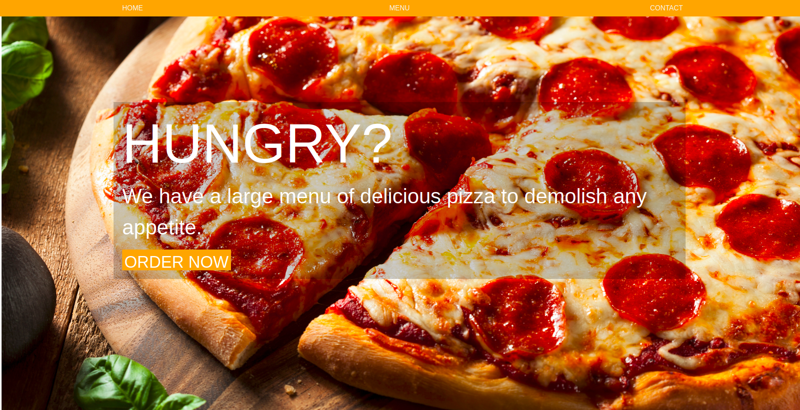
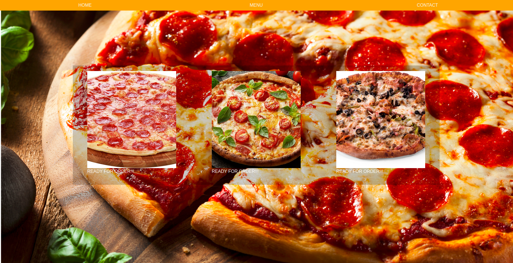
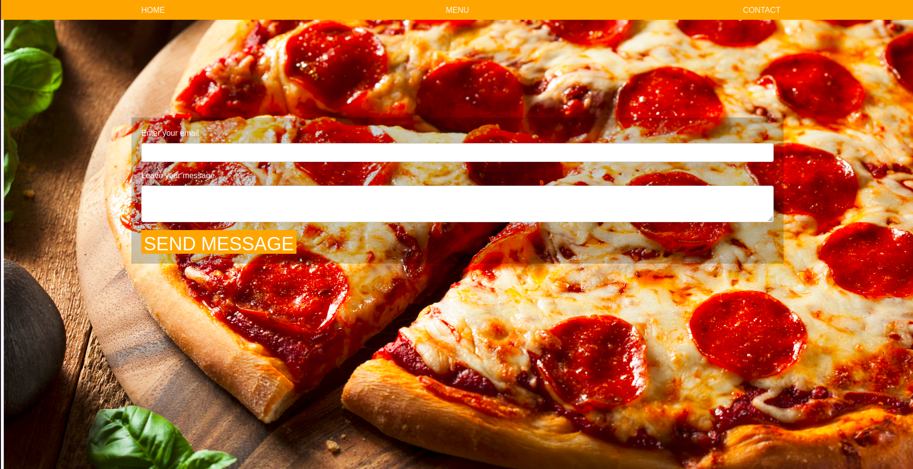

# Restaurant Flat Design Using Webpack

## Description

> This project consists of a single-page layout design that aims to demonstrate the understanding of webpack as a tool to bundle assets and the concept of modularizing the code base into single-task functions.

## Main Page

## Menu Page

## Contact Page

## Built With

- HTML
- CSS
- JAVASCRIPT
- WEBPACK
- BOOTSTRAP

## Getting Started

- Open the terminal command line.
- Clone the repo:--> git clone git@github.com:widzthedvloper/myRestaurant.git
- cd myRestaurant
- npm install
- If you experience any issue with images or javasript try runnind `npm run build`

## Authors

👤 **Widzmarc Jean Nesly Phelle**

- GitHub: [@widzthedvloper](https://github.com/widzthedvloper)
- Twitter: [@widzthedvloper](https://twitter.com/widzthedvloper)
- LinkedIn: [@widzthedvloper](https://www.linkedin.com/in/widzmarc-jean-nesly-phelle-252a26129/)

## 🤝 Contributing

Contributions, issues, and feature requests are welcome!

## Show your support

Give a ⭐️ if you like this project!

## Acknowledgement

- JAVASRIPT Project by Microverse.

## 📝 License

This project is [MIT](/LICENSE) licensed.
